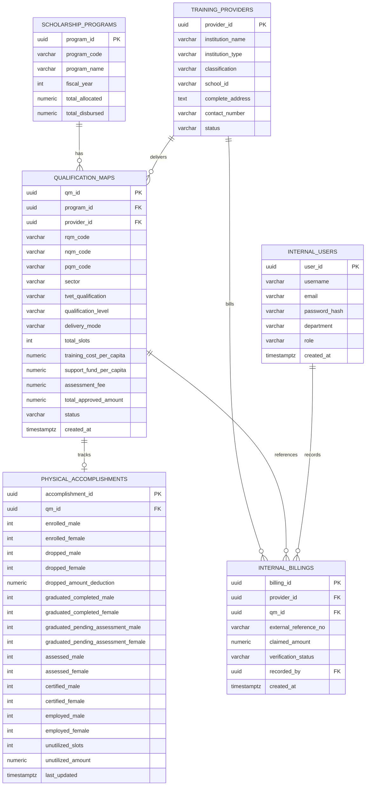

# Database Schema — Davao City Scholarship Programs Portal

> **Engine:** PostgreSQL 15  
> **Container:** `postgres:15-alpine` (Docker)  
> **Last Updated:** 2026-07-31

---

## 1. Entity-Relationship Diagram



---

## 2. Table Definitions (DDL)

### 2.1 `internal_users`

Stores pre-provisioned municipal personnel accounts. No self-registration.

```sql
CREATE TABLE internal_users (
    user_id         UUID PRIMARY KEY DEFAULT gen_random_uuid(),
    username        VARCHAR(100) NOT NULL UNIQUE,
    email           VARCHAR(255) NOT NULL UNIQUE,
    password_hash   VARCHAR(255),           -- nullable for Google-OAuth-only accounts
    department      VARCHAR(150) NOT NULL,
    role            VARCHAR(30)  NOT NULL
                        CHECK (role IN ('admin', 'evaluator', 'finance_auditor')),
    created_at      TIMESTAMPTZ  NOT NULL DEFAULT NOW()
);

CREATE INDEX idx_users_email ON internal_users (email);
CREATE INDEX idx_users_role  ON internal_users (role);
```

| Column | Type | Notes |
|--------|------|-------|
| `user_id` | UUID (PK) | Auto-generated |
| `username` | VARCHAR(100) | Display name, unique |
| `email` | VARCHAR(255) | Used for Google OAuth matching, unique |
| `password_hash` | VARCHAR(255) | bcrypt hash; NULL when user authenticates exclusively via Google |
| `department` | VARCHAR(150) | e.g. "City Social Welfare and Development Office" |
| `role` | VARCHAR(30) | One of: `admin`, `evaluator`, `finance_auditor` |
| `created_at` | TIMESTAMPTZ | Account creation timestamp |

---

### 2.2 `training_providers`

Institutional profiles of TVET schools and training centers.

```sql
CREATE TABLE training_providers (
    provider_id       UUID PRIMARY KEY DEFAULT gen_random_uuid(),
    institution_name  VARCHAR(255) NOT NULL,
    institution_type  VARCHAR(100) NOT NULL,      -- e.g. 'TVI', 'HEI', 'Company'
    classification    VARCHAR(100) NOT NULL,      -- e.g. 'Private', 'Public', 'LGU'
    school_id         VARCHAR(50)  UNIQUE,        -- external school ID from TESDA/DepEd
    complete_address  TEXT         NOT NULL,
    contact_number    VARCHAR(30),
    status            VARCHAR(20)  NOT NULL DEFAULT 'active'
                          CHECK (status IN ('active', 'inactive', 'suspended'))
);

CREATE INDEX idx_providers_status ON training_providers (status);
```

---

### 2.3 `scholarship_programs`

Top-level scholarship program definitions per fiscal year.

```sql
CREATE TABLE scholarship_programs (
    program_id       UUID PRIMARY KEY DEFAULT gen_random_uuid(),
    program_code     VARCHAR(50)   NOT NULL UNIQUE,
    program_name     VARCHAR(255)  NOT NULL,
    fiscal_year      INT           NOT NULL,
    total_allocated  NUMERIC(15,2) NOT NULL DEFAULT 0,
    total_disbursed  NUMERIC(15,2) NOT NULL DEFAULT 0
);

CREATE INDEX idx_programs_fy ON scholarship_programs (fiscal_year);
```

---

### 2.4 `qualification_maps`

Links a program to a provider with detailed training qualification metadata.

```sql
CREATE TABLE qualification_maps (
    qm_id                    UUID PRIMARY KEY DEFAULT gen_random_uuid(),
    program_id               UUID          NOT NULL REFERENCES scholarship_programs(program_id),
    provider_id              UUID          NOT NULL REFERENCES training_providers(provider_id),
    rqm_code                 VARCHAR(50),
    nqm_code                 VARCHAR(50),
    pqm_code                 VARCHAR(50),
    sector                   VARCHAR(150)  NOT NULL,
    tvet_qualification       VARCHAR(255)  NOT NULL,
    qualification_level      VARCHAR(30)   NOT NULL,
    delivery_mode            VARCHAR(50)   NOT NULL,
    total_slots              INT           NOT NULL CHECK (total_slots >= 0),
    training_cost_per_capita NUMERIC(12,2) NOT NULL,
    support_fund_per_capita  NUMERIC(12,2) NOT NULL DEFAULT 0,
    assessment_fee           NUMERIC(12,2) NOT NULL DEFAULT 0,
    total_approved_amount    NUMERIC(15,2) NOT NULL DEFAULT 0,
    status                   VARCHAR(20)   NOT NULL DEFAULT 'draft'
                                 CHECK (status IN ('draft', 'approved', 'completed', 'cancelled')),
    created_at               TIMESTAMPTZ   NOT NULL DEFAULT NOW()
);

CREATE INDEX idx_qm_program  ON qualification_maps (program_id);
CREATE INDEX idx_qm_provider ON qualification_maps (provider_id);
CREATE INDEX idx_qm_status   ON qualification_maps (status);
```

---

### 2.5 `physical_accomplishments`

Aggregate gender-disaggregated tracking per qualification map (one row per `qm_id`).

```sql
CREATE TABLE physical_accomplishments (
    accomplishment_id                    UUID PRIMARY KEY DEFAULT gen_random_uuid(),
    qm_id                               UUID          NOT NULL UNIQUE
                                             REFERENCES qualification_maps(qm_id),
    enrolled_male                        INT NOT NULL DEFAULT 0,
    enrolled_female                      INT NOT NULL DEFAULT 0,
    dropped_male                         INT NOT NULL DEFAULT 0,
    dropped_female                       INT NOT NULL DEFAULT 0,
    dropped_amount_deduction             NUMERIC(12,2) NOT NULL DEFAULT 0,
    graduated_completed_male             INT NOT NULL DEFAULT 0,
    graduated_completed_female           INT NOT NULL DEFAULT 0,
    graduated_pending_assessment_male    INT NOT NULL DEFAULT 0,
    graduated_pending_assessment_female  INT NOT NULL DEFAULT 0,
    assessed_male                        INT NOT NULL DEFAULT 0,
    assessed_female                      INT NOT NULL DEFAULT 0,
    certified_male                       INT NOT NULL DEFAULT 0,
    certified_female                     INT NOT NULL DEFAULT 0,
    employed_male                        INT NOT NULL DEFAULT 0,
    employed_female                      INT NOT NULL DEFAULT 0,
    unutilized_slots                     INT NOT NULL DEFAULT 0,
    unutilized_amount                    NUMERIC(12,2) NOT NULL DEFAULT 0,
    last_updated                         TIMESTAMPTZ   NOT NULL DEFAULT NOW()
);
```

---

### 2.6 `internal_billings`

Ledger-driven billing claims — reference-number based, no document storage.

```sql
CREATE TABLE internal_billings (
    billing_id            UUID PRIMARY KEY DEFAULT gen_random_uuid(),
    provider_id           UUID          NOT NULL REFERENCES training_providers(provider_id),
    qm_id                 UUID          NOT NULL REFERENCES qualification_maps(qm_id),
    external_reference_no VARCHAR(100)  NOT NULL,
    claimed_amount        NUMERIC(15,2) NOT NULL CHECK (claimed_amount >= 0),
    verification_status   VARCHAR(30)   NOT NULL DEFAULT 'pending'
                              CHECK (verification_status IN ('pending', 'verified', 'rejected', 'returned')),
    recorded_by           UUID          NOT NULL REFERENCES internal_users(user_id),
    created_at            TIMESTAMPTZ   NOT NULL DEFAULT NOW()
);

CREATE INDEX idx_billings_provider ON internal_billings (provider_id);
CREATE INDEX idx_billings_qm       ON internal_billings (qm_id);
CREATE INDEX idx_billings_status   ON internal_billings (verification_status);
```

---

## 3. Indexing Strategy

| Index | Table | Columns | Rationale |
|-------|-------|---------|-----------|
| `idx_users_email` | internal_users | email | OAuth lookup |
| `idx_users_role` | internal_users | role | RBAC filtering |
| `idx_providers_status` | training_providers | status | Active-provider queries |
| `idx_programs_fy` | scholarship_programs | fiscal_year | Year-based filtering |
| `idx_qm_program` | qualification_maps | program_id | FK join performance |
| `idx_qm_provider` | qualification_maps | provider_id | FK join performance |
| `idx_qm_status` | qualification_maps | status | Status filtering |
| `idx_billings_provider` | internal_billings | provider_id | Billing-by-provider lookups |
| `idx_billings_qm` | internal_billings | qm_id | Billing-by-qualification lookups |
| `idx_billings_status` | internal_billings | verification_status | Audit/verification queues |

---

## 4. Seed Data Strategy

- All seed data uses **fictional** institutions, names, and values.
- Seed scripts are idempotent (`INSERT … ON CONFLICT DO NOTHING`).
- Located in `backend/src/seed/`.
- Passwords in seed data use a well-known bcrypt hash of `"Password123!"` — never used in production.

---

## 5. Migration Strategy

- Migrations are sequential SQL files: `001_create_tables.sql`, `002_seed_data.sql`, etc.
- Each migration runs inside a transaction.
- A simple `migrations` tracking table records which files have been applied.
